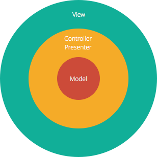

# Architectural Choices


## Frontend

### `Technologies & Frameworks`

1.Javascript\
2.ReactJs\
4.Socket.io


## `React Architecture`

<br />


<br />

## `Advantages`

<br />

1.This structure assists in developing a component-based software architecture that simplifies maintenance and code reuse. 

2.It enables you to maintain a global state variable by utilizing state management such as `usecontext hook`. 

3.Because this React architecture allows you to build out components, code expansion becomes much easier as your project grows. 

4.Since it is component-based, the React architecture makes unit testing much easier. 

## `Frontend(React) directory Structure`
```bash
├── node_modules
├── public
├── src
|     ├── Api
|     ├── Assets
|     ├── Components
|     ├── Constants
|     ├── Context
|     ├── Helpers
|     ├── Pages
|     ├── App.css
|     ├── App.jsx
|     ├── main.jsx
|
|     
├── index.html
├── package.json
├── vite.config.js


```


## Backend

### `Technologies & Frameworks`

1.Javascript\
2.Node.js\
3.Express.js\
4.MongoDB\
5.Socket.io


### `Layered (n-tier) architecture `

<br />




The Model-View-Controller (MVC) structure, which is the standard software development approach offered by most of the popular web frameworks, is clearly a layered architecture.
1.Model layer\
The database is the model layer, which often contains the information about the types of data in the database. 

2.Controller layer\
In the middle, we have the controller layer, which has various rules and methods for transforming the data moving between the view and the model.

3.View layer\
At the top is the view layer, which is often CSS, JavaScript, and HTML with dynamic embedded code. Here we are not going to use view layer in our project.Instead we send data to the frontend by means of REST API and SOCKET.IO. 


## `Advantages `
<br />
The advantage of a layered architecture is the  `separation of concerns`, which means that each layer can focus solely on its role. This makes it:

1.Maintainable\
2.Testable\
3.Easy to assign separate "roles"\
4.Easy to update and enhance layers separately


## `Backend directory Structure`


```bash
├── node_modules
├── Controllers
├── Db
├── Models
├── Routes
├── Socket     
├── index.js
├── package.json


```


